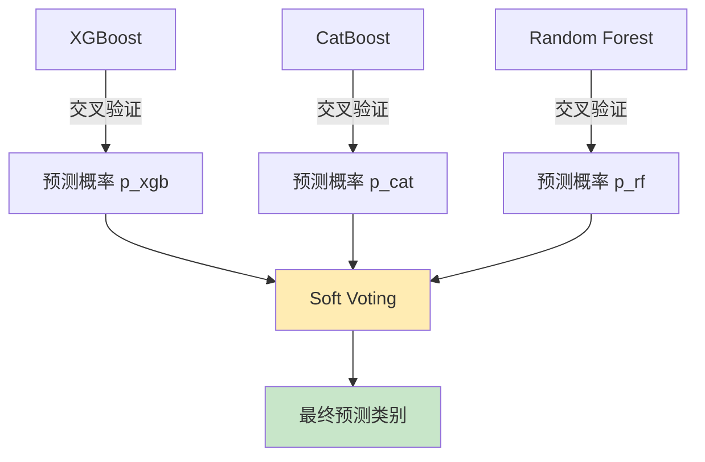
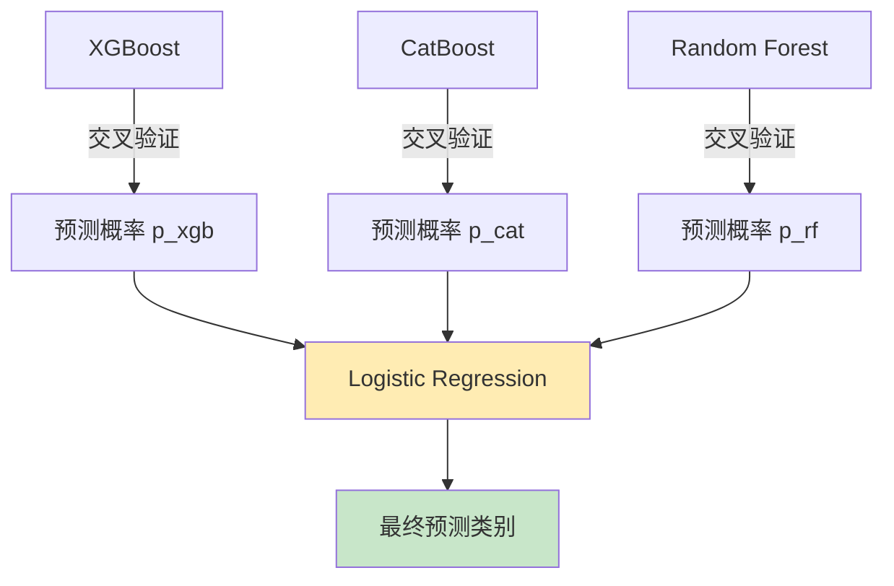
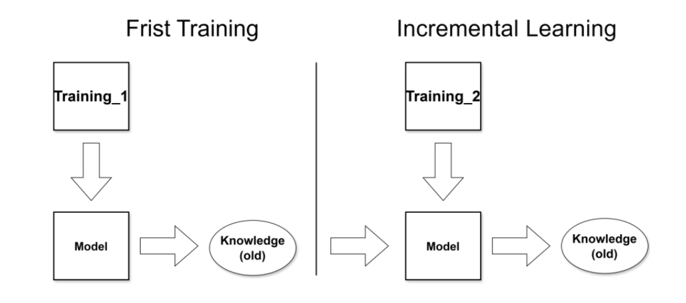
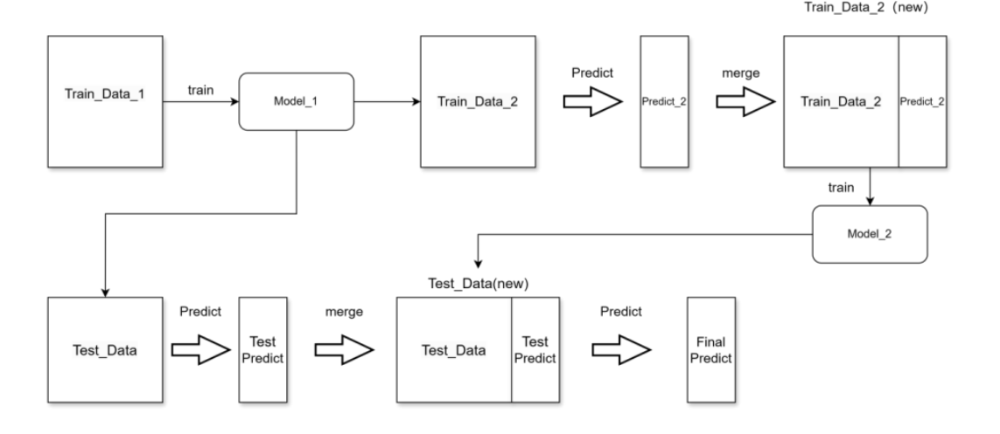

# 问题一：生产线故障自动识别与人员配置

## 📋 问题分析

分析生产线中各装置故障的数据特征，构建故障报警模型。生产线存在 **9种不同的故障状态** 以及 **1种无故障状态**，总共构成了 **10种不同的工作状态**。

**核心特点**：
- 同一时间内生产线仅会表现出一种故障状态或无故障状态
- 问题的本质是一个 **多分类问题**

## 🔧 数据预处理说明

本项目完成工业流水线数据的自动化预处理，为机器学习建模提供高质量特征。

### 数据处理流程图

### 核心处理逻辑

| 处理步骤 | 说明 | 技术要点 |
|---------|------|---------|
| **机器状态编码** | 故障列映射到唯一编码 | 正常状态为 0 |
| **特征融合** | 合并气缸/定位器状态 | 生成新特征 |
| **特征构建** | 构造具有物理含义的新特征 | **抓取 → 装填 → 加盖 → 拧盖** 各阶段的执行一致性 |
| **Duration 特征** | 按状态变化生成持续时间特征 | 捕捉状态持续信息 |
| **样本去重** | 故障样本全部保留 | 正常样本根据关键特征去重，仅保留一条 |

---

## 📊 评估指标

### 1. 总体准确率（Accuracy）

\[
\text{Accuracy} = \frac{\sum_{i=0}^{N-1} (TP_i + TN_i)}{\sum_{i=0}^{N-1} (TP_i + FP_i + FN_i + TN_i)}
\]

- \(N\)：类别总数  
- \(TP_i\)：类别 \(i\) 真正例  
- \(TN_i\)：类别 \(i\) 真负例  
- \(FP_i\)：类别 \(i\) 假正例  
- \(FN_i\)：类别 \(i\) 假负例  

### 2. 报警准确率（Warning Accuracy）

\[
\text{Warning Accuracy} = \frac{TP}{TP + FP}
\]

- \(TP\)：预测为故障且实际为故障的样本数  
- \(FP\)：预测为故障但实际非故障的样本数  

### 3. 故障准确率（Fault Accuracy）

\[
\text{Fault Accuracy} = \frac{\sum_{i=1}^{N} TP_i}{\sum_{i=1}^{N} (TP_i + FN_i)}
\]

### 4. 单类别召回率（Recall）

\[
\text{Recall}_i = \frac{TP_i}{TP_i + FN_i}
\]

## ⚖️ 采样策略

为应对类别不平衡，本项目采用以下策略：

### 1. SMOTE 过采样（SMOTE Resampling）

**原理**：通过生成少数类样本，提升模型对少数类的学习能力

**技术细节**：
- 使用 `SMOTE` 算法
- 可指定 `k_neighbors` 和 `sampling_strategy`
- 通过插值方式生成合成样本

### 2. 欠采样（Undersampling）

**原理**：通过减少多数类样本数量，降低类别偏差

**技术细节**：
- 多数类随机删除一定比例样本
- 与少数类合并
- 保持数据集平衡

---

## 🤖 模型构建

本项目采用多模型进行故障预测，包括 **随机森林（RF）、XGBoost、CatBoost**。

### 基模型构建

| 步骤 | 方法 | 说明 |
|------|------|------|
| **模型训练** | 随机搜索（RandomizedSearchCV） | 或网格搜索进行超参数调优 |
| **模型评估** | 多指标综合评估 | 准确率、报警准确率、故障准确率和单类别召回率 |

---

## 📈 实验结果

### 基模型整体性能对比

| 模型 | Accuracy (%) | Warning Accuracy (%) | Fault Accuracy (%) |
|:----:|:-----------:|:--------------------:|:------------------:|
| XGBoost | **99.979** | 99.984 | 98.702 |
| CatBoost | 99.975 | 99.979 | **98.994** |
| RF | 99.970 | **99.980** | 98.500 |

### 各故障类别召回率

| 故障类别 | XGBoost | CatBoost | RF |
|:--------:|:-------:|:--------:|:--:|
| 无故障 | 0.9998 | 0.9998 | 0.9993 |
| 1001 | 0.9971 | 0.9993 | 1.0000 |
| 2001 | 0.9983 | 0.9975 | 0.9977 |
| 4001 | 1.0000 | 1.0000 | 1.0000 |
| 4002 | 0.9980 | 0.9982 | 0.9994 |
| 4003 | 0.9994 | 0.9761 | 0.9488 |
| 5001 | 0.9456 | 0.9698 | 0.9807 |
| 5002 | 0.9998 | 0.9999 | 0.9974 |
| 6001 | 0.9305 | 0.9586 | 0.9306 |
| 6002 | 1.0000 | 1.0000 | 1.0000 |

---

## 🔗 集成学习

### 1. Soft Voting

**技术特点**：
- 采用 **Stratified K-Fold** 进行交叉验证，保证各折中类别分布一致
- 每一折训练一个基模型，并对测试集输出预测概率
- 对多模型 **XGBoost + RandomForest + CatBoost** 进行 **软投票（Soft Voting）**

### 2. Stacking

**架构说明**：

| 层级 | 模型 | 功能 |
|------|------|------|
| **第一层基分类器** | XGBoost、CatBoost、RandomForest | 采用 Stratified K-Fold 进行交叉验证，输出每折预测概率 |
| **第二层元模型** | 逻辑回归（Logistic Regression） | 输入第一层输出的概率特征，输出最终类别预测 |

### 集成模型性能对比

| 模型 | Accuracy (%) | Warning_Accuracy (%) | Fault_Accuracy (%) |
|:----:|:-----------:|:--------------------:|:------------------:|
| Soft Voting | 99.983 | 99.986 | **99.310** |
| Stacking | **99.986** | **99.989** | 99.219 |

### 集成模型故障预测结果对比

| 故障类别 | Soft Voting | Stacking |
|:--------:|:-----------:|:--------:|
| 无故障 | 0.9999 | 0.9999 |
| 1001 | 0.9998 | 0.9989 |
| 2001 | 0.9980 | 0.9978 |
| 4001 | 1.0000 | 1.0000 |
| 4002 | 0.9985 | 0.9985 |
| 4003 | 0.9915 | 0.9868 |
| 5001 | 0.9802 | 0.9760 |
| 5002 | 0.9999 | 0.9998 |
| 6001 | 0.9603 | 0.9636 |
| 6002 | 1.0000 | 1.0000 |

---

## 🚀 创新性方案

### 1️⃣ 经验学习（Experience Learning）

  

**核心思想**：利用旧模型的预测结果作为新的特征输入，引导新模型学习历史经验。

#### 流程说明

**输入：**
  * 旧模型预测结果
  * 新数据特征

**处理方式：**
  * 将旧模型预测值作为新特征拼接到输入中

**优势**：
- ✅ 利用历史模型经验
- ✅ 提升模型稳定性与泛化能力
- ✅ 适合分阶段训练任务

### 2️⃣ 增量学习（Incremental Learning）

  

**核心思想**：在已有模型基础上继续训练新数据，避免重复全量训练。

#### 流程说明
**输入：**
  * 新增数据特征+标签

**处理方式：**
  * 在已训练模型基础上引入新数据进行训练

**优势**：
- ✅ 减少训练时间
- ✅ 降低计算成本
- ✅ 适合持续更新的数据场景

###  增量学习 & 经验学习模型预测准确率对比

| 模型 | Accuracy (%) | Warning_Accuracy (%) | Fault_Accuracy (%) |
|:----:|:-----------:|:--------------------:|:------------------:|
| 增量学习 | 99.984 | 99.991 | 97.387 |
| 经验学习 | 99.977 | 99.983 | 97.722 |

### 各类故障召回率

| 故障类别 | 增量学习 | 经验学习 |
|:--------:|:--------:|:--------:|
| 无故障 | 0.9999 | 0.9999 |
| 1001 | 0.9844 | 0.9945 |
| 2001 | 0.9844 | 0.9936 |
| 4001 | 1.0000 | 1.0000 |
| 4002 | 0.9953 | 0.9982 |
| 4003 | 0.9587 | 0.9997 |
| 5001 | 0.9377 | 0.9346 |
| 5002 | 0.9988 | 0.9995 |
| 6001 | 0.9312 | 0.9062 |
| 6002 | 1.0000 | 1.0000 |

---

## 📝 总结

本项目通过多层次的模型构建和创新的训练策略，实现了生产线故障的高精度识别：

1. **数据预处理**：构建了完整的数据处理流程，为模型训练提供高质量特征
2. **基模型**：采用 XGBoost、CatBoost、Random Forest 三种强模型，准确率均达到 99.9% 以上
3. **集成学习**：通过 Soft Voting 和 Stacking 进一步提升模型性能
4. **创新方案**：提出经验学习和增量学习两种创新方法，为持续学习提供新思路
