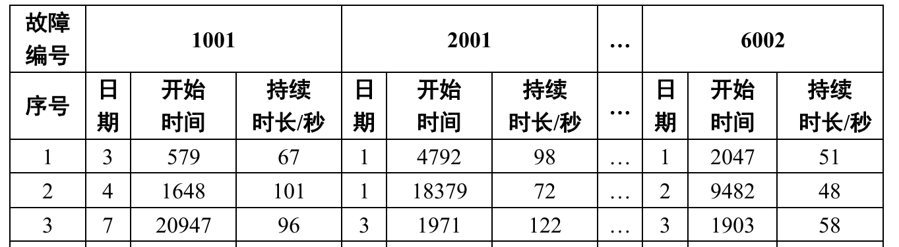

# 问题二：生产线故障自动报警统计

## 任务目标

实现生产线中各装置故障的自动即时报警，给出故障报警的日期、开始时间与持续时长，格式如下：

  

## 模型结果处理

在对预测数据进行统计时，发现模型预测的故障存在以下问题：

- **故障次数偏多**
- **故障持续时间不合理**

为了提高预测结果的合理性，需要对模型输出进行 **平滑处理**，主要包括以下两种方法：

#### 1.短时故障剔除

- 对预测结果中极短的故障段（通常 1~3 秒）进行检查
- 如果该段周围的数据都是正常状态（预测为 0），则将这段短时故障修正为正常状态
- **作用**：有效减少模型的"假阳性"故障判定

#### 2. 段内少数值修正

- 在一段连续故障中，如果大部分数据点属于同一故障类型，少数点被判为其他状态，则根据出现频次将少数点修正为主故障类型
- **作用**：消除局部异常，保证同一故障段的连续性和一致性

## 平滑处理效果分析

### 整体准确率对比

| 模型    | Accuracy（%） | Warning_Accuracy（%） | Fault_Accuracy（%） |
| ------- | ------------- | --------------------- | ------------------- |
| 未平滑处理 | 99.983        | 99.986                | 99.310              |
| 平滑处理  | 99.981        | 99.989                | 99.356              |

### 各类故障准确率对比

| 故障类别 | 未平滑处理  | 平滑处理   |
| -------- | ----------- | ---------- |
| 无故障   | 0.9999      | 0.9998     |
| 1001     | 0.9998      | 1.0000     |
| 2001     | 0.9980      | 0.9985     |
| 4001     | 1.0000      | 1.0000     |
| 4002     | 0.9985      | 1.0000     |
| 4003     | 0.9915      | 0.9915     |
| 5001     | 0.9802      | 0.9836     |
| 5002     | 0.9999      | 1.0000     |
| 6001     | 0.9603      | 0.9673     |
| 6002     | 1.0000      | 1.0000     |

### 效果说明

经过平滑处理后，大部分故障类别的预测准确率有所提升，尤其是 5001、6001 等原本低于 0.99 的类别，说明平滑处理有效改善了模型的局部异常判定，提高了故障预测的整体一致性和可靠性。
